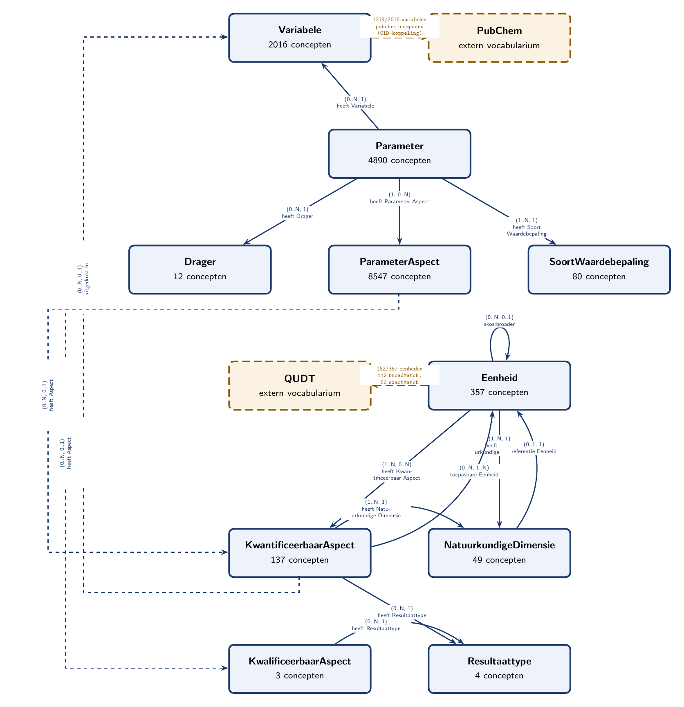

# csor-testing

Testproject voor het Vlaamse CSO-register (CSOR): herhaalbare SPARQL-analyses en Python-scripts
die de datakwaliteit van CSOR toetsen (interne consistentie én consistentie met externe bronnen
zoals PubChem).

Zie `CLAUDE.md` voor projectconventies (mapstructuur, scriptheader-formaat, SPARQL-valkuilen),
`sparql/` voor de querydefinities en `reports/` voor de resulterende rapporten.

## Snel starten

```bash
python3 -m venv .venv
.venv/bin/pip install --index-url https://pypi.org/simple -r requirements.txt
.venv/bin/python scripts/run_all.py
```

## CSOR-datamodel

<!-- CSOR-DIAGRAM:START -->


*Bron: `output/diagrams/csor_model.tex` ([PDF](output/diagrams/csor_model.pdf)), gegenereerd door `scripts/generate_diagram.py`. Elke box toont het aantal actieve concepten van die klasse; elke pijllabel toont de CSOR-property en de kardinaliteit als (bron-klasse per één doel-instantie, doel-klasse per één bron-instantie) — bv. bij `Parameter -> Variabele` betekent (0..N, 1): een variabele heeft 0..N parameters, een parameter heeft precies 1 variabele.*
<!-- CSOR-DIAGRAM:END -->
